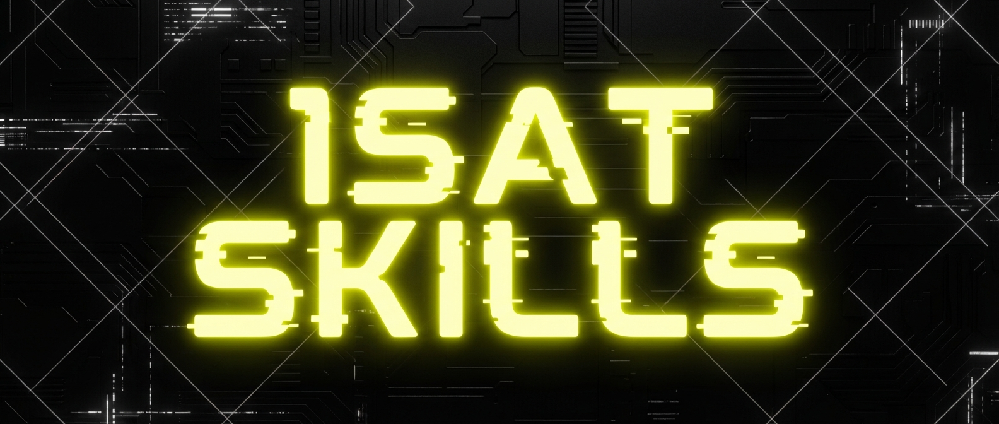

# 1Sat Skills

1Sat ecosystem tools for Claude Code. Unified BSV indexing API, ordinals NFT operations, media extraction, and marketplace browsing.

## Installation

```bash
bunx skills add b-open-io/1sat-skills --skill 1sat-stack
bunx skills add b-open-io/1sat-skills --skill extract-blockchain-media
bunx skills add b-open-io/1sat-skills --skill wallet-create-ordinals
bunx skills add b-open-io/1sat-skills --skill ordinals-marketplace
```

## Skills

| Skill | Description |
|-------|-------------|
| `1sat-stack` | Unified BSV indexing API - replaces all other indexers |
| `wallet-setup` | Wallet creation, sync, address management, backup/restore |
| `wallet-create-ordinals` | Mint ordinals, inscribe data, deploy BSV21 tokens |
| `token-operations` | Send, receive, list, and manage BSV21 fungible tokens |
| `sweep-import` | Import BSV, ordinals, and tokens from external wallets |
| `opns-names` | OpNS name registration and identity key binding |
| `dapp-connect` | Build dApps with @1sat/connect and @1sat/react |
| `timelock` | Lock and unlock BSV with block height conditions |
| `transaction-building` | General tx building, batch payments, OP_RETURN data, signing |
| `ordinals-marketplace` | Browse, list, purchase, and cancel ordinal listings |
| `extract-blockchain-media` | Extract media files from blockchain transactions |

## Prerequisites

**CLI Tools**

```bash
# Install txex globally for media extraction
bun add -g txex
```

**Packages**

```bash
# For ordinals operations
bun add @1sat/core @1sat/client @1sat/types @bsv/sdk

# For browser dApps (optional)
bun add @1sat/connect

# For React apps (optional)
bun add @1sat/react
```

Note: The old `js-1sat-ord` package has been replaced by the `@1sat/sdk` monorepo packages.

## Related

- **@1sat/sdk** - Official 1Sat SDK monorepo with all packages
- **@1sat/wallet** - BRC-100 wallet engine with ordinals support
- **bsv-skills** - Core BSV wallet and transaction skills
- **1Sat Ordinals Docs**: https://docs.1satordinals.com/
- **1sat.market**: https://1sat.market - Ordinals marketplace and wallet
- **1Sat API**: https://api.1sat.app — Unified indexing API

## What are 1Sat Ordinals?

NFTs and inscriptions on BSV:
- Arbitrary data stored on-chain (images, text, files)
- Unique satoshi-level identification
- Permanent, immutable storage
- Active marketplace for trading

## Known Ecosystem Gaps

The following capabilities are **not yet supported** by the 1sat-sdk or 1sat-stack. These represent areas for future development:

| Capability | Description | Priority |
|-----------|-------------|----------|
| Multi-signature | M-of-N signing, cosigner coordination, threshold schemes | High |
| Hash Puzzles / HTLC | Hash time-locked contracts for atomic swap primitives | Medium |
| Atomic Swaps | Cross-token or cross-chain trustless exchange | Medium |
| Payment Channels | Off-chain scaling with open/close channel lifecycle | Low |
| Auction Support | On-chain bidding protocols for ordinals/tokens | Low |

These are tracked for future SDK development. Contributions welcome.

**Previously listed gaps now covered by the ecosystem:**
- **Key Rotation** — Supported by BAP (bsv-bap) protocol. See `bsv-skills:create-bap-identity` and `bsv-skills:manage-bap-backup`.
- **Encrypted Messaging** — ECIES encryption supported by BAP and `@bsv/sdk`. See `bsv-skills:encrypt-decrypt-backup`.
- **Backup/Restore** — Supported by `bitcoin-backup` library + CLI. See `bsv-skills:encrypt-decrypt-backup` and `bsv-skills:manage-bap-backup`.

## License

MIT
